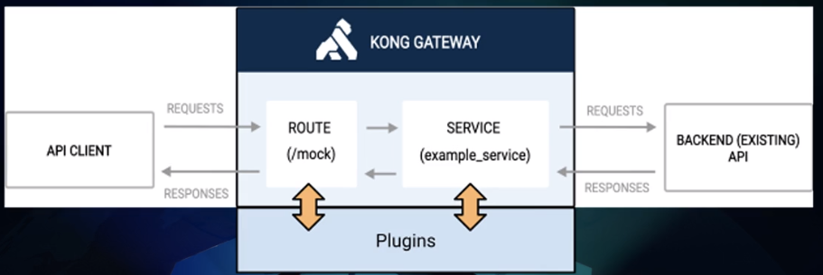
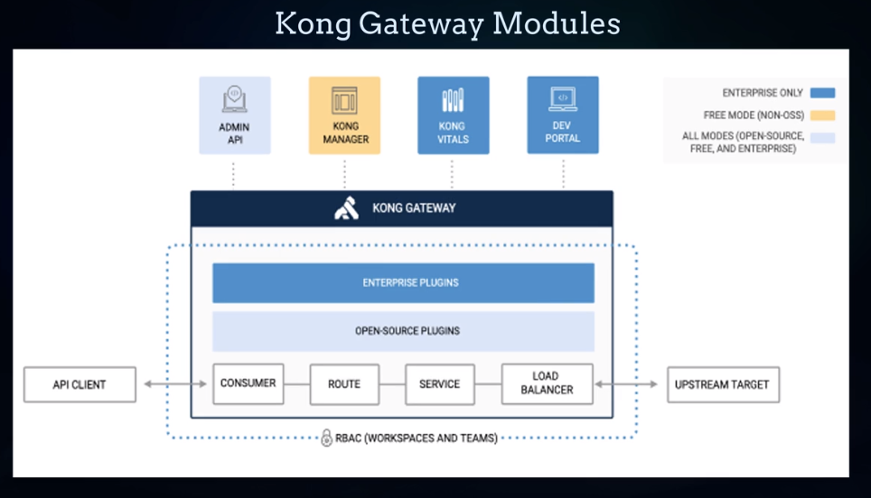
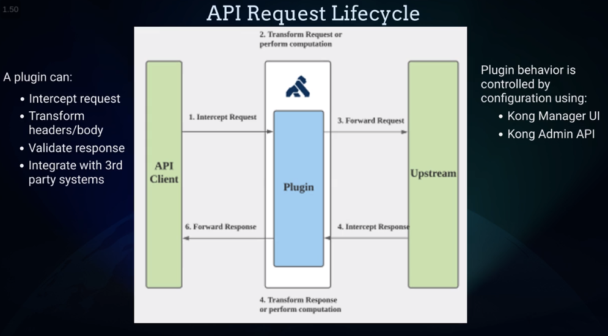
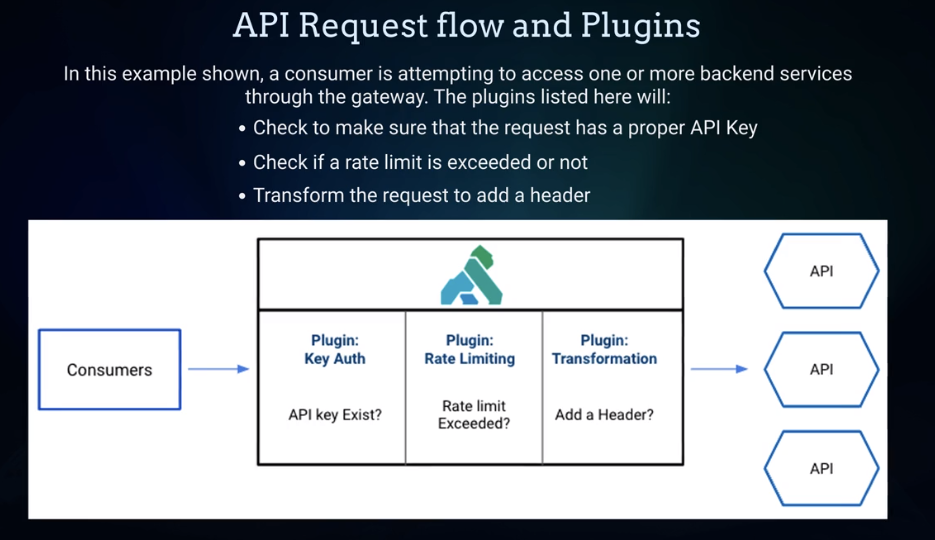
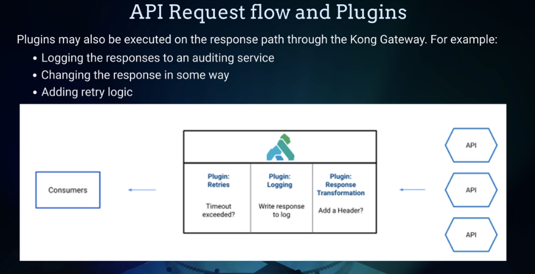

TODO

- [x] API Gateway general points 
- [ ] API Gateway Kong general points
- [ ] Course (KGAC-101) Kong Gateway Foundations
- [ ] Learn about API Authentication methods
- [ ] Aplication Architectue Models
       - [ ] Monolithic
       - [ ] Microservice
       - [ ] Event Driven Serveless
       - [ ] Cloud-Based
- [ ] Load Balance  
- [ ] Proxy VS Reverse Proxy

### **What is an API Gateway?**

An API Gateway is a server or service that acts as an intermediary between client applications and backend services or APIs. It serves as a **single entry point** for clients to access multiple APIs, providing a centralized and unified interface. The primary function of an API Gateway is to manage, control, and secure API traffic.

##### Key aspects of an API Gateway and its significance:

1.  **Request Routing**: API Gateways enable intelligent routing of client requests to the appropriate backend services based on the requested endpoints, paths, or other parameters. It allows for efficient load balancing and distribution of traffic.

Ex: An e-commerce plataform may have separate microservices:
- Product catalog
-  Inventory management
- Payment processing
- 
The api gateway can route requests based on the requested endpoints to the respective microservices.
    
2.  **API Composition**: An API Gateway can aggregate or combine multiple backend API calls into a single request. This reduces the number of client-server round trips and improves performance and efficiency.
    
Ex: A mobile application requires data from different APIs to populate a user's profile page. The API Gateway can orchestrate requests to the 
- User information service
-  Activity log service
- Social media integration service

And then combine the responses into a single payload that is sent back to the mobile app.

3.  **Protocol Translation**: API Gateways can handle protocol translations, allowing clients to use different protocols or data formats than those supported by the backend services. It promotes interoperability and simplifies integration for clients.

Ex: Consider a scenario where a frontend application sends GraphQL queries to the API Gateway, which then translates these queries into multiple RESTful requests to various microservices. The API Gateway aggregates the responses from the microservices and converts them into a single GraphQL response that is returned to the client.
    
5.  **Security and Authentication**: API Gateways provide authentication and authorization mechanisms to secure API access. They can enforce authentication protocols, such as OAuth or JWT, and implement security policies like rate limiting, request validation, and encryption.
    
6.  **Monitoring and Analytics**: API Gateways collect and analyze data on API traffic, usage patterns, and performance metrics. This information helps in monitoring API health, identifying issues, and making informed decisions for optimization and scalability.
    
7.  **Caching**: API Gateways can cache API responses to serve subsequent requests from the cache instead of forwarding them to the backend services. Caching reduces the response time and improves scalability by reducing the load on backend systems.

Ex: The API Gateway can implement caching for frequently requested data or static content. For instance, an e-commerce platform may cache product catalog information or promotional banners that do not change frequently. Caching reduces the load on backend services, improves response times, and
 
The significance of an API Gateway lies in its ability to provide a unified, controlled, and secure access point to backend services. It simplifies the client-server interaction by handling common tasks like routing, security, and protocol translation. Additionally, an API Gateway improves scalability, performance, and reliability by managing and optimizing API traffic. It plays a crucial role in building robust and scalable API ecosystems, enabling organizations to expose and manage their services effectively.

### [(KGAC-101) Kong Gateway Foundations](https://education.konghq.com/enrollments/167664512/details)

##### Core Feratures of API Managment 

* API Gateway: Main component of an API management system | Gateway routes the request to the correct upstream API Service.
* API Portal: Central place where API providers and consumers colaborate.
* API Analytics:  Provides different types of dashboards and reporting with usage information.
* API Security: Protect your APIs | Provides role-based access control 
* API Lifecycle Mgmnt: Allows organizations to manage every aspect of the API lifecycle.
* API Policy Mgmnt: Controls the API management policy life cycles. | Provides out-of-box policy control mechanisms.

##### API Value Chain and Maturity

It's possible to classify API's Maturity in 5 groups

1. APIs for systems connectivity:  Provide access to core enterprise information. 

Initial stage of API maturity, where APIs are primarily used for connecting systems and enabling communication between them. APIs in this category focus on basic integration, data exchange, and interoperability between different applications or services. Ex: ERP, CRM, HCM, etc.
	
2. APIs for enterprise mobility and productivity: Provide access to business processes. At this stage, APIs start to play a role in enhancing enterprise mobility and productivity. These APIs are designed to provide access to business processes and services, allowing employees, partners, or customers to interact with enterprise systems and perform tasks more efficiently. Ex: APIs for employee self-service or document management. 

3. APIs for Omni-channel enablement: APIs in this group are specifically aimed at enabling omni-channel experiences for customers. They allow seamless integration between various channels such as web, mobile, social media, and physical stores, providing a consistent and unified experience across different touchpoints. These APIs facilitate functionalities like synchronized shopping carts, personalized recommendations, or real-time inventory updates across channels.

4. APIs for partner collaboration:  This category focuses on APIs that enable collaboration and integration with external partners, suppliers, or vendors. These APIs enable secure and controlled access to specific data or functionalities, allowing partners to integrate their systems with the organization's systems, automate processes, and exchange information in a standardized manner. Examples include APIs for supply chain integration, partner portal access, or B2B integration

5. APIs for monetization: APIs in this maturity group are designed to generate revenue and create new business opportunities. They go beyond enabling connectivity and focus on exposing valuable services or data that can be monetized by external developers or partners. These APIs may be offered through developer portals, with different pricing models, and may include features such as usage analytics, developer documentation, and billing integration.

The 5 steps above are incremental, só the number 1 is the first and so on until get to the monetization level.

##### API-Led Architecture

Is an approach to designing interfaces (APIs) as the **Primary means of communication between different components and systems within an organization**. This technique promotes modularity, reusability, and flexibility.

##### > API-led architecture should address the following aspects

1. Modularity: This archtecture should enable the decomposition of systems into modular, self-contained services that can be developed, deployed and scaled independently.

2. Loose Coupling:
3. Reusability:
4. Governance and Management:
5. Integration:
6. Securing APIs from unauthorized access and major security threats.
7. Ensuring that consuming applications can aways find the rignt API endpoint.
8. The support of capabilitires like API design, testing, continuous integration, life cycle mmgnt, monitoring, and operations.
9. Error handling 
10. Real time monitoring of APIs with analytics and insight.
 
##### Introducing APIOps 

What is it ?

- The complete end-to-end automation of an API lifecycle.
- Combines the principles of DevOps and GitOps

Benefits ?

- Quality and common standards across all APIs
- Faster and repeatable API platform deployments
- Decrease complexity of versioning 

### API Gateway Architecture

#### Definition:

An API Gateway is a server-side architectural component in a microservices environment that acts as a central interface between clients and backend services. It provides a unified, single point of entry into a system, thus abstracting the underlying microservices architecture and streamlining the interaction between client applications and the system's various microservices.
The primary role of an API Gateway is to manage and route incoming client requests to the appropriate microservices. Through URL routing rules, the Gateway determines which service is best equipped to fulfill a request, effectively enabling service orchestration. This function is crucial in a microservices ecosystem, where services might be spread across different servers, containers, or even geographically disparate data centers.
Moreover, the API Gateway offloads shared operational tasks from individual services, handling tasks such as rate limiting, caching, and security enforcement (like JWT authentication and API key validation). By centralizing these cross-cutting concerns, it ensures a consistent application of policies across multiple services and reduces code duplication.
The Gateway also facilitates protocol translation. For instance, a client might interact with the API Gateway over a standard RESTful HTTP API, and the Gateway could then communicate with microservices using another protocol.
Another crucial feature of API Gateways is their ability to aggregate responses from multiple microservices into a single response to the client, a concept known as API composition. This feature simplifies client-side programming by reducing the number of separate requests the client must make.
Finally, an API Gateway is an ideal location for logging, metrics (kong table), and tracing as it has visibility into all traffic entering and leaving the microservices system. Consequently, it plays a pivotal role in system monitoring and observability, enabling tracking of request/response lifecycles and system health diagnostics.
In essence, an API Gateway in a microservices architecture plays a multifaceted role in request routing, protocol translation, security enforcement, rate limiting, API composition, and system monitoring, making it a vital tool in managing complexity and improving system performance.

#### Benefits:

##### Reduce Complexity
- Routing requests thought a single entry point, reducing complexity.
- Simplify the interface of the application, combining multiple requests into just one (**API composition**)
##### Improved performance
- Cache commonly used and requested data and then, distribute across multiple servers. (app does not need fetching all requests).
##### Security
- Provide aditional layer of security by authenticating and authorizing requests before they reach the backend services.
- Act as a barrier between the outside world, filtering traffic and only allowing though requests that meet your security criteria.
 
#### Uses:
- Provaides management functions of: authentication, routing, rate limiting, biling, monitoring, analytics, polices, alerts and security.
- Make it easier to build, deploy and manage the overall system.

### Key Terms 

- Upstream: backend services or microservices to which the gateway routes incoming client requests. Essentially, it's the direction from the gateway to the services performing the requested operations. The term is commonly used in network-related discussions.
- Proxy: part of the API Gateway's role, acts as an intermediary between client applications and backend services. It receives client requests, forwards them to the appropriate backend services (upstream), and returns the services' responses back to the clients. This helps manage and control network traffic.
-   A Reverse Proxy, in the context of an API Gateway, accepts client requests and forwards them to appropriate backend services. It's called a "reverse" proxy because it handles requests for backend services from the client side, essentially acting as an intermediary to control and manage traffic flow.
- 
1.  **Proxy Server (Forward Proxy)**: This is used primarily by clients (users) accessing a server. When a client makes a request, the proxy server acts on behalf of the client to request data from the internet. The proxy can hide the client's IP, perform caching, or filter content. The destination server does not know who the original requester is because the request appears to be coming from the proxy server.
    
2.  **Reverse Proxy**: This operates on the side of the server, not the client. It handles requests from the internet (clients) to the server. The reverse proxy can distribute the load from incoming requests among several servers, control which servers handle the requests, or even perform SSL encryption for a website. The client does not know about the server and believes the response is coming directly from the reverse proxy.

### **What is Kong API Gateway?**

Cloud-native, fast, scalable, and distributed Microservice Abstraction Layer (also known as an **API Gateway**, ** API Middleware** or in some cases **Service Mesh**). It is designed to secure, manage and extend APIs and Microservices.

Developed by Kong Inc. (originally known as Mashape), the Kong API Gateway is an open-source solution that functions as a centralized interface for routing API requests. It acts as a **proxy** between API Consumers (like web applications, mobile applications, or other services) and the API providers (which could be databases, serverless functions, or actual servers with services running on them).

1.  **Pluggability**: Kong has a plugin architecture that allows you to extend its core functionality with custom plugins.
    
2.  **Performance**: Kong is built on top of the NGINX HTTP server and uses an event-driven, non-blocking I/O model which makes it lightweight and efficient.
    
3.  **Security**: Kong can help secure your APIs and microservices by implementing features such as authentication, authorization, IP whitelisting, and bot detection.
    
4.  **Developer friendliness**: It provides a RESTful API which can be used to manage its configuration, or alternatively, you can manage it through its admin dashboard.
    
5.  **Scalability and reliability**: Kong supports horizontal scaling and offers functionalities like load balancing, circuit breakers, health checks, and more.
    
6.  **Platform agnostic**: You can run Kong on virtually any platform - from bare metal to Kubernetes and everything in between.

### Kong Gateway Architecture

- OpenResty: is an open-source web platform that integrates the **Nginx** web server with the **LuaJIT** (Just-In-Time Compiler for Lua) runtime, enabling developers to build high-performance web applications with the power of Lua scripting. OpenResty's blend of Nginx's web server capabilities with the versatility of Lua scripting makes it a powerful choice for developers seeking to build high-performance web applications, APIs, and microservices.

- Declarative configuration :Uses yaml/cli to confiugurate kong.

### Kong Gateway Deployment Topologies

Kong gateway can be deployed in various topologies based on the infrastructure requirements. 

1. **Single Node Deployment**: In this basic configuration, Kong is deployed on a single server or container. It serves as the API gateway and manages the traffic between clients and backend services. This topology is suitable for small-scale applications with limited traffic and minimal redundancy requirements.

2. **High Availability (HA) Cluster**: To ensure high availability and fault tolerance, Kong can be deployed in a cluster mode with multiple instances distributed across different servers or containers. A load balancer sits in front of the Kong nodes, distributing incoming traffic evenly among the nodes. If one node goes down, the load balancer redirects traffic to the remaining healthy nodes.

3. **Microservices Deployment**: In a microservices architecture, Kong can be deployed alongside the microservices it manages. Each microservice typically has its own instance of Kong, and a global Kong instance (often referred to as the control plane) manages and orchestrates these instances. This topology provides better isolation and scalability for microservices.

4. **Hybrid Deployment:**: For larger and more complex applications, a hybrid deployment may be used. This combines elements from multiple topologies, utilizing single nodes, clusters, and microservices deployment as needed to suit specific requirements.

### Kong Gateway Operation

Kong Gateway listens for HTTP trafic on its configured proxys ports and L4 trafic on explicitly configured stream_listen ports.

Kong Gateway will evaluate any incomming HTTP request or L4 connections against the routes you have configured and try to find a maching one.

If a given request matches the rules of a specific route, kong Gateway will process proxying request.

Each route may be linked to a service the gateway will run the plugins that has benn configured on the route and the associated service and will then proxy the request upstream. 

### Kong Manager

It's a grapical user interface for management of a kong Gateway.
It uses kong Admin api under the hood to administer and control Kong Gateway. 

#### What you can do with it ?

- Manage all workspaces 
- Create and manage resource objects.
- Activate or deactivate plugins
- Group resource objects how you want them.
- Manage users and roles for kong Gateway and the Dev Portal.
- Monitor performance.

### Kong Plugins

- Provide advanced functionality and extend the use of the kong Gatewat, which allows you to add new features to your implementation.

### Kong Workspaces

Kong workspaces aimed to enable isolation and separation of configuration data across different environments or tenants within a Kong cluster. In a typical deployment, a Kong cluster shares a common datastore for its configuration, which can be problematic when you need to manage multiple environments (e.g., development, staging, production) or serve multiple tenants (e.g., different clients or teams) with distinct configurations.

The key objectives of Kong workspaces were:

Isolation: Workspaces would allow you to create isolated configuration spaces within a Kong cluster, ensuring that data from one workspace does not interfere or overlap with data from another.

Environment-Specific Configuration: You could use workspaces to define environment-specific configurations without the need for separate Kong instances or deployments.

Tenant Management: For multi-tenant environments, you could use workspaces to manage the configuration of each tenant securely.

### Kong deck

Is a CLI tool used to manage kong's configuration declaratively, with no need to run individual API commands to kong's admin endpoint, you can jus define desired state on a YAML file and let deck Sync config to kong. Lets tou run diffs to detect any changes. 

### Perguntas

Qual a diff do Kong manager VS Kong deck ??? 
O que significa esses content types:

- application/json
- application-x-www-form-urlencoded
- multipart/form-data 

### GOK (Good to Know)

- **L4 traffic**:  also known as Layer 4 traffic, refers to network communication that operates at the transport layer of the OSI (Open Systems Interconnection) model. The transport layer is responsible for end-to-end communication between hosts and provides services such as reliable data delivery, flow control, and error checking. Two commonly used protocols at this layer are TCP (Transmission Control Protocol) and UDP (User Datagram Protocol). In the context of Kong Gateway, L4 traffic on explicitly configured stream_listen ports refers to network traffic that is handled directly by Kong without going through the HTTP layer. Kong supports stream processing through the use of stream_listen directives in its configuration file. These directives enable Kong to listen on specific ports and process TCP or UDP traffic, allowing it to act as a TCP/UDP proxy.

### Kong Gateway configuration

 - kong Manager UI
 - Requests to Kong Adm API
   - RESTful API 
   - Declarative method (YAML)
 - kong configuration file (/etc/kong/kong.cong.default)
 - Kong ENV Variables: declare an environment variable with the name of setting in kong.conf prefixed with 'kong_'
 - Kong gateway CLI: there are 14 available commands, like `kong check`, `kong migrations`, `kong start`, `kong stop`, ... 

### Kong Gateway resource entities

#### Services

A service represents the upstream **Applications APIs**, **Microservices** that kong will manage.
The URL/Host/Port to proxy traffic  are config as attributes to the services.

#### Routes 

Entry points for requests. Where a **service** represents the backend api, the **route** defines what is exposed to the clients.

#### Consumers

Represents the clients of a kong service. Could be web-apps or other APIs.

#### Upstream targets

It represents a virtual hostname and can be used to helth check, circuit break, and load balance over multiple service.

Upstream targets represent the backend services or servers where the actual business logic or data processing resides. When a client sends an API request through Kong Gateway, the gateway evaluates the request and uses its routing rules to determine which upstream target(s) the request should be forwarded to.

For example, if you have an API managed by Kong Gateway with multiple versions or different functionalities hosted on different backend servers, you can define these backend servers as upstream targets. When a request comes in for a specific API endpoint, Kong will route the request to the appropriate upstream target based on the defined rules. This allows Kong to load balance across multiple instances of the same service, handle failover, or distribute traffic based on various factors.

Upstream targets in Kong Gateway can be specified using a combination of hostname, port, and path. The upstream targets can be individual servers or server groups, making it possible to scale and distribute the workload efficiently.

By using upstream targets, Kong Gateway abstracts the complexities of the backend infrastructure from clients and allows for easier management and scaling of microservices. Additionally, it enables the use of various plugins and policies specific to each upstream target, providing granular control over how requests are processed and responses are handled for each service.

### Kong Gateway Plugins

- Plugins allow easily add new features and functionality to the API. Like Auth, Rate Limit, caching, transformations, etc . 
- Can be applied globally or scoped to specifc sercides or routes
- Kong Plugin Hub: plataform that provides 3rd party, official and community provided plugins available.

