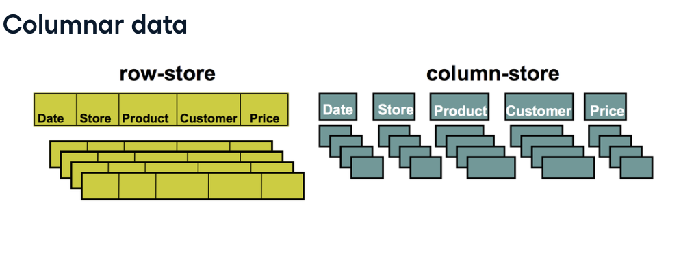
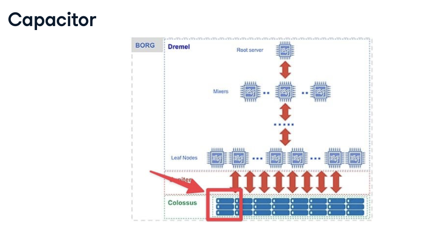
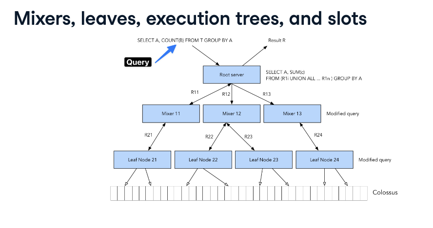

## BigQuery

Launched in 2012 using the same tools asGoogle uses
Online analytical processing (OLAP)
Separate compute and storage
Serverless
Only run on Google Cloud
Point in time analysis (once a day or hour)
Popular for analytical queries (reports)

Tools that compete with BigQuery

-- Snowflake

Popular amongst developers
Runs on any cloud
Specific tiers of compute resources (small,medium, etc)

-- Amazon RedShift

Constant computation or serveless
Suited for live dashboarding

-- SQL databases

Online transactional processing (OTAP)
Compute and storage are linked
Non-distributed

How is BigQuery used?

1. Reports that run at a specific time period or day (daily ecommerce reports, quarterlyreports)
2. Ad-hoc discovery (marketing campaign analysis) [No contexto de queries, "ad-hoc" se refere a consultas que são criadas de maneira improvisada para atender a uma necessidade específica no momento, em vez de serem parte de um conjunto de consultas pré-definidas ou rotineiras. ]

 

### BigQuery Arquitecture

#### Columnar data

#### Categorized architecture

#### Storage
- Capacitor
- Colossus (handles replication and recovery when a disk crashes. And handles distributed manadgement)

#### Compute

- Jupiter
- Borg

#### Query Execution (Dremel)

- Mixers
- Leaf nodes
- Execution tree
- Slots

##12-07-24
#### Recap

When you left 8 days ago, you worked on Writing queries and data types, chapter 2 of the course Introduction to BigQuery. Here is what you covered in your last lesson:

You learned about the structure and organization of data in BigQuery, which is crucial for running large analytical queries efficiently. BigQuery's unique approach to data organization involves three main levels:

Projects: The top-level structure in Google Cloud that manages user and permission controls. A project can contain multiple datasets.
Datasets: Act like schemas in other SQL databases, containing tables underneath them. Datasets have their own permissions, allowing for controlled access and the ability to query and join tables across datasets.
Tables: Where the actual data is stored. Tables are the final element in the BigQuery table naming structure.
Additionally, you discovered the importance of regions and zones in BigQuery. Data centers, represented as regions, can have multiple zones. BigQuery features two multi-regions, one for the United States and one for the European Union, which are crucial for data storage and querying policies. Once a dataset's region is set, it cannot be changed, emphasizing the need for strategic planning regarding data location and access.

Through exercises, you practiced identifying the hierarchy of BigQuery's table structure and applied these concepts in a real-world scenario by querying distinct seller cities from a dataset. For example:

SELECT DISTINCT seller_city FROM ecommerce.ecomm_sellers;
This query demonstrates how to specify both the dataset and table when querying data in BigQuery, highlighting the importance of understanding BigQuery's unique data organization for effective data management and analysis.

The goal of the next lesson is to explore how to optimize queries in BigQuery for improved performance and cost efficiency.