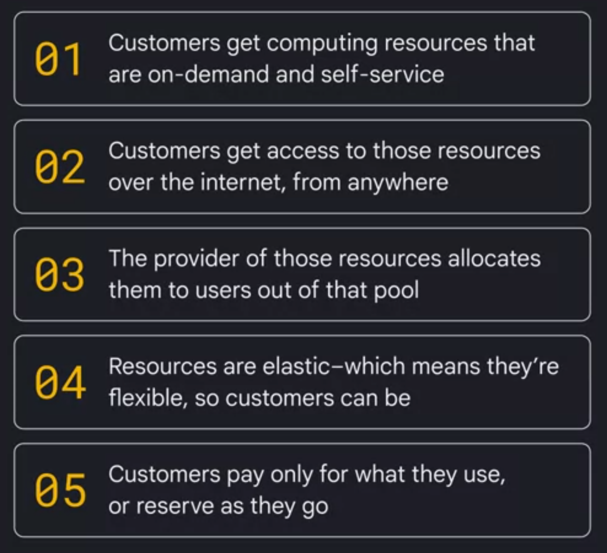
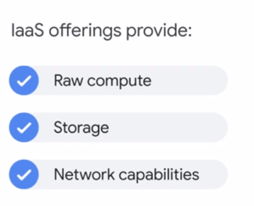
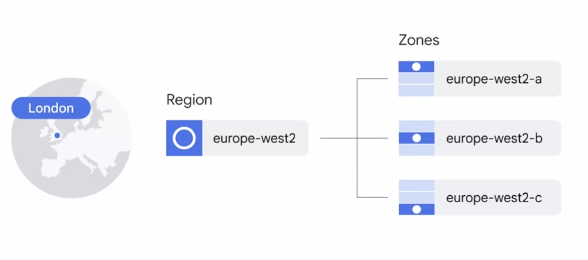

## Cloud computing overview

### IaaS

IaaS delivers on-demand infrastructure resources via the cloud, such as: raw compute, storage, and network capabilities, organized virtually into resources that are similar to physical data centers.
Compute Engine is an example of a Google Cloud IaaS service.

### PaaS

PaaS offerings, in contrast, bind code to libraries that provide access to the infrastructure application needs. This allows more resources to be focused on application logic.

App Engine is an example of a Google Cloud PaaS service.

In the IaaS model, customers pay for the resources they allocate ahead of time; in the PaaS model, customers pay for the resources they actually use.

### Serveless

Serverless is yet another step in the evolution of cloud computing. It allows developers to concentrate on their code, rather than on server configuration, by eliminating the need for any infrastructure management.

Serverless technologies offered by Google include Cloud Functions, which manages event-driven

## The Google Cloud network

Google Cloud runs on Google’s own global network. It’s the largest network of its kind, and Google has invested billions of dollars over many years to build it. This network is designed to give customers the highest possible throughput and lowest possible latencies for their applications by leveraging more than **100 content caching nodes worldwide**. These are locations where high demand content is cached for quicker access, allowing applications to respond to user requests from the location that will provide the quickest response time. 

* Google Cloud’s locations underpin all of the important work we do for our customers. From redundant cloud regions to high-bandwidth connectivity via subsea cables, every aspect of our infrastructure is designed to deliver your services to your users, no matter where they are around the world.

Google Cloud’s infrastructure is based in five major geographic locations: North America, South America, Europe, Asia, and Australia. Having multiple service locations is important because choosing where to locate applications affects qualities like availability, durability, and latency, the latter of which measures the time a packet of information takes to travel from its source to its destination.

### Regions 

Each of these locations is divided into several different regions and zones. Regions represent independent geographic areas and are composed of zones.

Some of Google Cloud’s services support placing resources in what we call a multi-region. For example, Cloud Spanner multi-region configurations allow you to replicate the database's data not just in multiple zones, but in multiple zones across multiple regions, as defined by the instance configuration. hese additional replicas enable you to read data with low latency from multiple locations close to or within the regions in the configuration, like The Netherlands and Belgium. 

## Security

....

## Pricing and billing

Google was the first major cloud provider to deliver per second billing for its Infrastructure as a Service, compute offering, compute engine. In addition, per second billing is now also offered for users of Google Kubernetes Engine, our Container infrastructure as a Service, data pro which is the equivalent of the big data system Hadoop, but operating as a service, and app engine, flexible environment, VMs, a Platform as a Service, Compute engine offers automatically applied sustained use discounts, which are automatic discounts that you get for running a virtual machine instance for a significant portion of the billing month.

  * Specifically, when you run an instance for more than 25% of a month, compute engine automatically gives you a discount for every incremental minute you use for that instances

Custom virtual machine types allow compute engine virtual machines to be fine tuned with optimal amounts of vCPU and memory for the applications so that you can tailor your pricing for your workloads.

You can define budgets at the billing account level or at the project level. A budget can be a fixed limit or it can be tied to another metric. 

  * For example, a percentage of the previous month spend. To be notified when costs approach your budget limit, you can create an alert,. For example, with a budget limit of $20,000 and an alert set at 90% you'll receive a notification alert when your expenses reach $18,000. 

Google Cloud also implements quotas which are designed to prevent the over consumption of resources because of an error or a malicious attack protecting both account owners and the Google Cloud community as a whole. There are two types of quotas

  - **Rate quotas** reset after a specific time. For example, by default, the GKE service implements a quota of 3,000 calls to its API from each Google Cloud project every 100 seconds. After that 100 seconds, the limit is reset.
  - **Allocation quotas** govern the number of resources you can have in your projects. For example, by default, each Google Cloud project has a quota allowing it no more than 15 virtual private cloud networks.