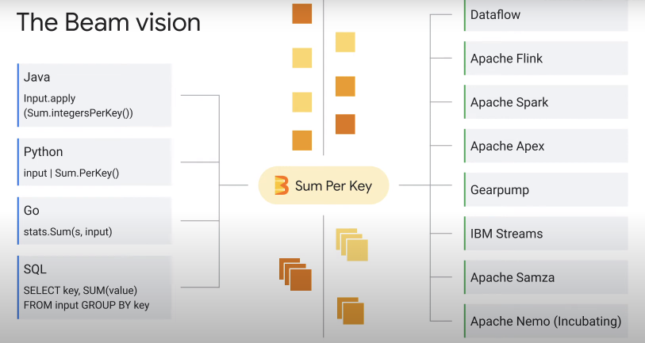
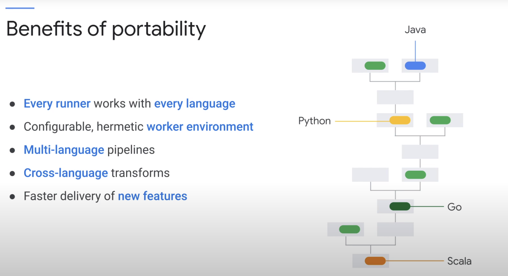
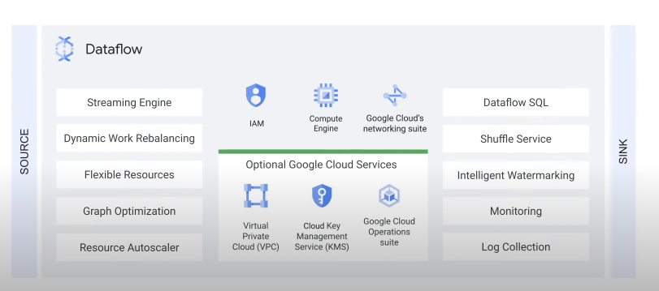
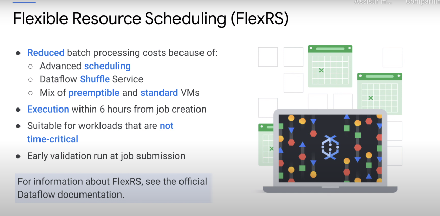
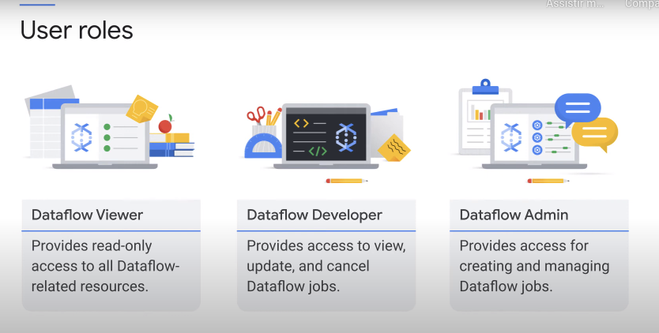

# Serverless Data Processing with Dataflow: Foundations

## Bean and Dataflow

Apache Beam is an open source unified programming model to define both batch and streaming processing pipelines.

To create a pipeline, you can use the Beam SDK of the language of your choice to build a program that defines your data-processing pipeline.

A pipeline can be run locally on your computer, remotely on a virtual machine in a data center, or by using the services of a cloud provider. Each runner has its own configuration, and it is associated with a backend service. **Dataflow is one of the runners available in Apache Beam.**

### Beam portability

With Beam, you also have the flexibility to move your data processing pipeline from your own premise environment to Dataflow on Google Cloud or any other clouds.

### How to separate compute and storage with Dataflow

Dataflow allows you to execute your VM pipelines on Google Cloud. 

- Fully managed and autoconfigured.
- Dataflow optimizes the graph execution by fusing operations efficiently and by not waiting for previous steps to finish before starting a new one unless there is a dependency involved.
- Autoscaling happens step by step in the middle of a pipeline job

### Dataflow Shuffle service

A shuffle is a Dataflow-based operation behind transforms such as GroupByKey, CoGroupByKey, and Combine. The Dataflow Shuffle operation partitions and groups data by key in a scalable, efficient, fault-tolerant manner.

The service-based Dataflow Shuffle feature available for batch pipelines only moves the shuffle operations out of the worker VMs and into the Dataflow service backend. With the Dataflow Shuffle service, you will have faster execution time of batch pipelines for the majority of the job types. The worker nodes will benefit from a reduction in consumed CPU, memory, and persistent disk storage resources, and your pipelines will have better autoscaling because the worker nodes VMs no longer hold any shuffle data, and can therefore be scaled down earlier

### Dataflow streaming engine

Streaming engine offloads the window state storage from the persistent disks attached to worker VMs to a back-end service.

- implements an efficient shuffle for streaming cases
- Worker nodes continue running your user code and implements data transforms and transparently communicate with a streaming engine to source state.
- With the dataflow streaming engine, you will have a reduction in consumed CPU, memory, and persistent disk storage resources on the worker VMs. This leads to a lower resource and quota consumption.
- Streaming engine works best with smaller worker machine types like n1-standard-2, and does not require persistent disks beyond a smaller worker boot disk.
- With streaming engine, your pipeline will be more responsive to variations to incoming data volume.

### Flexible Resource Scheduling

FlexRS helps you reduce the cost of your batch processing pipelines because you can use **advanced scheduling techniques** in the Dataflow Shuffle Service and leverage a mix of preemptible and normal virtual machines.

## IAM, Quotas and Permissions

When the pipeline is submitted, it is sent to two places. The SDK uploads your code to Cloud storage and sends it to the Dataflow service. The Dataflow service does a few things. It validates and optimizes the pipeline, it creates the Compute Engine virtual machines in your projects to run
your code, it deploys the code to the VMs, and it starts to gather monitoring information for display. When all that is done, the VMs will start running your code. At each of the stages we mentioned-- user submission of code, Dataflow validating the pipeline, and the VM running-- IAM plays a role in determining whether to continue the process.

- Three credentials determine whether a Dataflow job can be launched

1. User roles: The first credential that is checked is the user role. When you submit a code, whether you are allowed to submit it is determined by the IAM role set to your account. On Google Cloud, your account is represented by your email address.Ex: when I submit a Dataflow job, it is done via fernando.stopasola@rdstation.com. 

If a user only has the Dataflow developer role, they can view and cancel jobs that are currently running, but
they cannot create jobs because the role does not have permissions to stage the files and view the Compute Engine quota.

You can use the Dataflow developer role as a building block to compose custom roles. For example, if you also want to be able to create pipelines, you can create a role that has the permissions from the Dataflow developer role plus the permissions required to stage files to a bucket and to view the Compute Engine quota.

**Admin**: The last role you can assign to a user or group is the Dataflow admin role, use this role to provide a user or group with the minimum set of permissions that allow both creating and managing Dataflow jobs. The Dataflow admin role allows a user or group to interact with Dataflow and stage files in an existing Cloud storage bucket and view the Compute Engine quota.

2. Service Accounts:

Dataflow uses the Dataflow service account to interact between your project and Dataflow. For example, to check project quota, to create worker instances on your behalf, and to manage the job during job execution.
 

For example, to check project quota, to create worker instances on your behalf, and to manage the job during job execution. When you run your pipeline on Dataflow, it uses the service account service- @dataflow-service-producer-prod
iam.gserviceaccount.com. This account is automatically created when the Dataflow API is enabled. It is assigned the Dataflow service agent role and has the necessary permissions to run a Dataflow job in your project.

2. Controller service account 

The controller service account is assigned to the Compute Engine VMs to run your Dataflow pipeline.

By default, workers use your project's Compute Engine default service account as the controller service account.

This service account, <project-number>-compute @developer.gservices.com, is automatically created when you enable the Compute Engine API for your project from the API's page in the Google Cloud console.

The Compute Engine default service account has broad access to your project's resources, which makes it easy to get started with Dataflow. For production workloads, we recommend that you create a new service account with only the roles and permissions that you need

At a minimum, your service account must have the Dataflow worker role and can be used by adding the service account email flag when launching a Dataflow pipeline.
