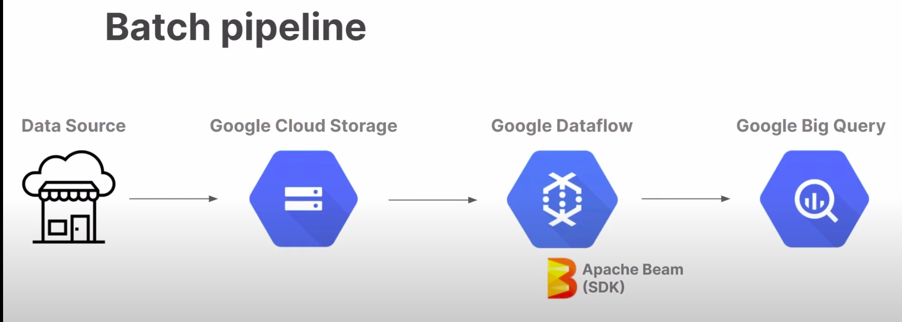
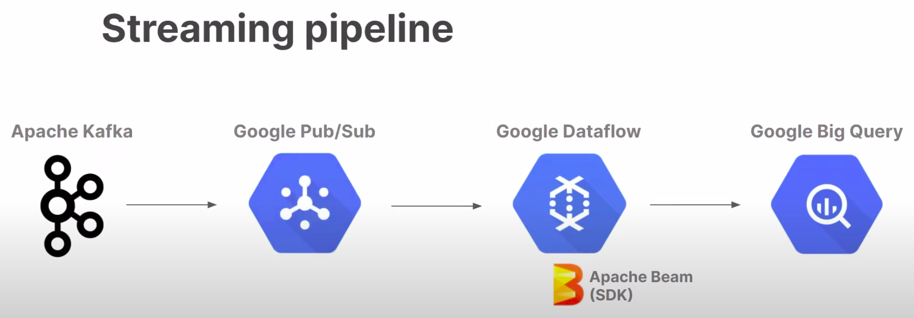
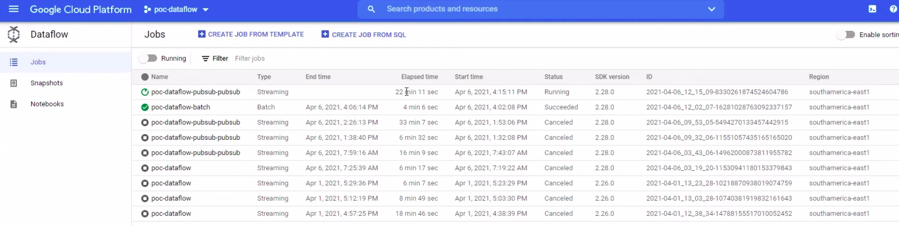
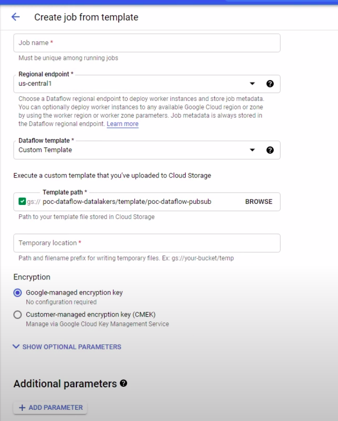
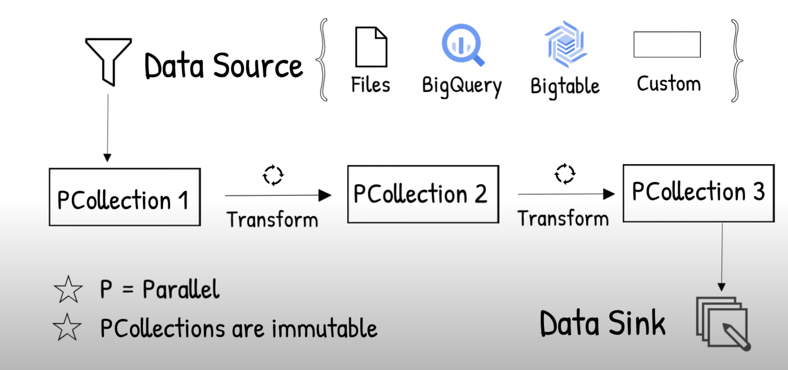

# Google Dataflow: 

-  Serviço de processamento de dados em stream ou batch
-  Serviço de provisionamento, gerenciamento e escalonamento automático de recursos
-  Desenvolvimento utilizando Apache Beam SDK (JAVA)

Principais vantagens:

- Configuração rápida e simplificada de pipelines
- Redução de custo com emprego otimizado de workers
- Processamento Serveless

É possível criar dataflow jobs usando: Clould Console UI, gCloud CLI e APIs.

## Jobs

Exemplo da gerencia de jobs:

- Qual a diferença de um job batch e um job streamming:

Criação de jobs via template:

Exemplo de pipe

