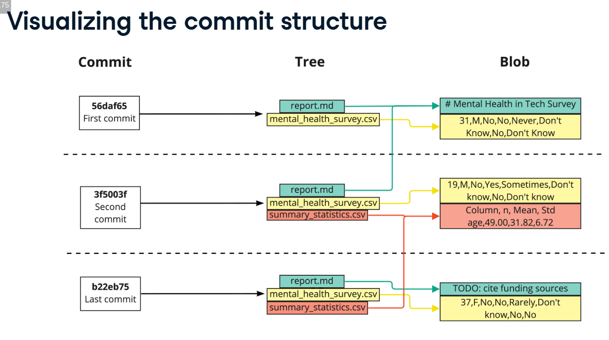
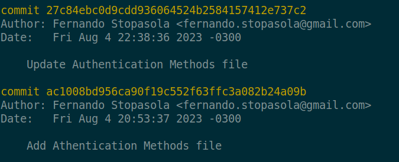

## What is version control?

Processes and systems to manage changes to files, programs, and directories


## What can version control do?

- Track files in different states
- Combine different versions of files
- Identify a particular version
- Revert changes


## Git commands

### Creating a new repo

> git init mental-health-workspace

### Git version

> git --version

## [Conventional Commit Messages](https://gist.github.com/qoomon/5dfcdf8eec66a051ecd85625518cfd13)


### Types
- API or UI relevant changes
    - `feat` Commits, that add or remove a new feature to the API or UI
    - `fix` Commits, that fix a API or UI bug of a preceded `feat` commit
- `refactor` Commits, that rewrite/restructure your code, however do not change any API or UI behaviour
    - `perf` Commits are special `refactor` commits, that improve performance
- `style` Commits, that do not affect the meaning (white-space, formatting, missing semi-colons, etc)
- `test` Commits, that add missing tests or correcting existing tests
- `docs` Commits, that affect documentation only
- `build` Commits, that affect build components like build tool, ci pipeline, dependencies, project version, ...
- `ops` Commits, that affect operational components like infrastructure, deployment, backup, recovery, ...
- `chore` Miscellaneous commits e.g. modifying `.gitignore`


### Description

The description contains a concise description of the change.

- Is a mandatory part of the format
- Use the imperative, present tense: "change" not "changed" nor "changes"
- Think of This commit will... or This commit should...
- **Don't capitalize the first letter**
- **No dot (.) at the end**

### Body

The body should include the motivation for the change and contrast this with previous behavior.

**Is an optional part of the format**
Use the imperative, present tense: "change" not "changed" nor "changes"
This is the place to mention issue identifiers and their relations


### Examples
- ```
  feat: add email notifications on new direct messages
  ```
- ```
  feat(shopping cart): add the amazing button
  ```
- ```
  feat!: remove ticket list endpoint

  refers to JIRA-1337

  BREAKING CHANGE: ticket enpoints no longer supports list all entites.
  ```
- ```
  fix(shopping-cart): prevent order an empty shopping cart
  ```
- ```
  fix(api): fix wrong calculation of request body checksum
  ```
- ```
  fix: add missing parameter to service call

  The error occurred because of <reasons>.
  ```
- ```
  perf: decrease memory footprint for determine uniqe visitors by using HyperLogLog
  ```
- ```
  build: update dependencies
  ```
- ```
  build(release): bump version to 1.0.0
  ```
- ```
  refactor: implement fibonacci number calculation as recursion
  ```
- ```
  style: remove empty line
  ```


What is a Git repo?

Is a storage space where your project files and their revision history are kept. It allows you to track changes to your files over time, collaborate with others, and manage different versions of your project. A Git repo can be hosted locally on your computer or remotely on a server, such as GitHub, GitLab, or Bitbucket.

When you initialize a Git repository, Git creates a hidden directory called `.git` in the root of your project. This directory contains all the metadata and object database for your project, including information about commits, branches, and tags. The `.git` directory is what makes a directory a Git repository.

## Creating a new repo


> git init mental-health-workspace

> cd mental-health-workspace

> git status





###Git log:



#### Restricting the file

To only look at the commit history of one file:

> git log report.md

#### Finding a particular commit

Only need the first 8-10 characters of the hash

> git show c27fa856

#### git diff

- Compare last committed version of report.md with the version in the staging area

> git diff --staged rep


- Comparing two commits

> git diff 35f4b4d 186398f

- Compare second most recent with the most recent commit

> git diff HEAD~1 HEAD

### Reverting files

> git revert HEAD 

OR

> git revert 5er5a

### Revert a single file

> git checkout 5er5a -- report.md


### Unstaging a single file

> git restore --staged statistics.csv

### Unstaging all files

> git restore --staged


### Listing all branches


git branch

