Epistemologia é o nome dado ao estudo do conhecimento e suas formas. Tenta descobrir como o conhecimento é adquirido pelas pessoas a partir dos princípios da crença, verdade e justificativa. Atualmente é compreendida como a Teoria do Conhecimento, mas nem sempre foi assim.

- Análise de Dados Aplicados

### Teste de hipótese

==>  Problema da indução

- Ciência é indutiva, abrea mão da certeza e verdade em detrimento da dúvida

Um exemplo sobre o problema da indução, é que para se testar a hipótese que 10.000 ovos, são de galinha, é necessário testar um a um, o que seria virtualmente impossível no caso de uma pesquisa de remédios por exemplo. Por isso em uma pesquisa, sempre buscamos testar os diferentes.

- H0 é a chamada hipótese nula. Testa a igualdade ==
- Ha é a hipótese alternativa, testa a diferença !=

- Explicação simples de P: é a chance de erro em afirmar que coisas são diferentes
Ex: Ao assumir que o Grupo A é diferente do Grupo B, tenho um p = 0,01%. O processo engloba chegar ao valor de p. Em um segundo momento é afirmado se o p é baixo ou pequeno. 

==> Vídeo novo

Estatistic descritiva

Organizar, resumir, e apresentar os dados (tabelas gráficos e medidas-resumo)

 - N tem conclusões nessa etapa
 - Observar determinados aspectos relevantes e começar a delinear hipóteses

 - Se faz perguntas como:

 Os dados me dizem algo importante ?

 ==> Temos 3 tipos de estatistica descritiva:

 Univariada
 Bivariada: busco relações entre variáveis 
 Multivariada

==> Univariada

Tipo de variável:

Qualitativa:

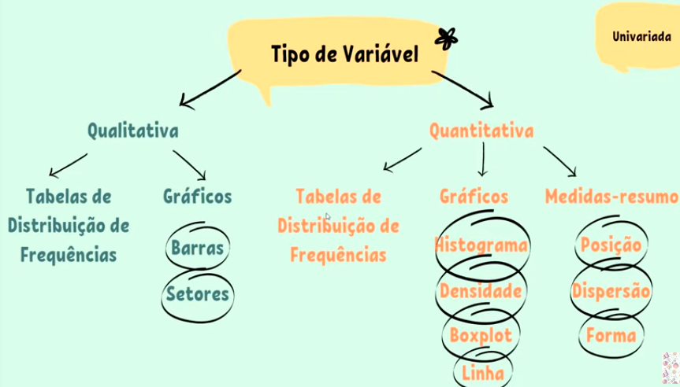

# Medidas-Resumo
## Medidas de Posição

### Medidas de Tendência Central: 

#### Média :é um resumo dos dados, por issso, pode esconder informações relevantes.
#### Média Ponderada: a ponderação é feita sempre que precisamos dar mais importância a um caso do que ao outro (atribuir pesos diferentes). A mediana é uma medida robusta, o que significa que ela não é sensível a valores extremos ou discrepantes nos dados, tornando-a útil para resumir conjuntos de dados que podem conter valores atípicos ou extremos.

#### Moda: la representa o valor que aparece com mais frequência em um conjunto de dados. Em outras palavras, a moda é o número que ocorre com maior frequência. A moda é especialmente útil quando estamos interessados em identificar os valores mais comuns ou populares em um conjunto de dados. É a unica medida de posição que também pode ser usada para variáveis qualitativas.

#### Mediana: representa o valor que está exatamente no meio de um conjunto de dados quando esses números estão organizados em ordem crescente ou decrescente. 

### Medidas Separatrizes: Quartis, Decis e Percentis

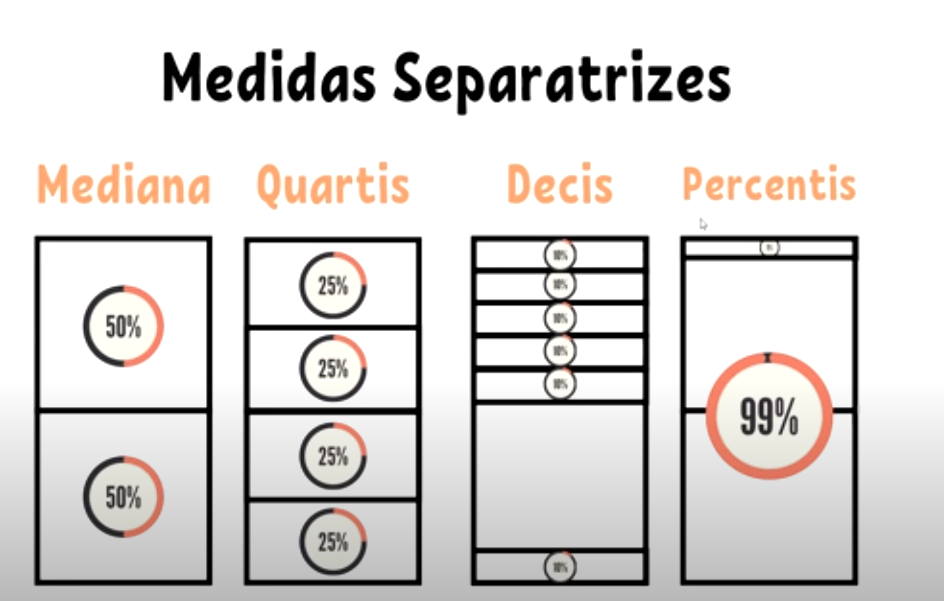

- Medidas de Dispersão

#### Amplitude: representa a diff entre o maior e menor elemento de um conjunto.

#### Desvio-médio Absoluto: média aritimética dos desvios absolutos.

#### Variância: 

A variância é uma medida que nos ajuda a entender o quão espalhados ou dispersos estão os valores em um conjunto de dados. Ela calcula a média das diferenças quadradas entre cada valor e a média geral do conjunto. Isso pode parecer um pouco complicado, mas, basicamente, a variância nos diz o quão os valores se afastam da média. Quanto maior a variância, mais espalhados estão os dados, e quanto menor, mais próximos eles estão da média.
Por exemplo, considere um conjunto de números: 2, 4, 6, 8, 10. A média é 6. Agora, calculamos as diferenças quadradas entre cada valor e a média: (2-6)², (4-6)², (6-6)², (8-6)², e (10-6)². Somamos essas diferenças quadradas e as dividimos pelo número total de valores no conjunto - 1. O resultado é a variância, também chamada de s². Fica assim:
Calculamos a média dos valores: (2 + 4 + 6 + 8 + 10) / 5 = 30 / 5 = 6.
Calculamos as diferenças entre cada valor e a média e, em seguida, elevamos essas diferenças ao quadrado: (2-6)² = 16, (4-6)² = 4, (6-6)² = 0, (8-6)² = 4, (10-6)² = 16.
Somamos essas diferenças quadradas: 16 + 4 + 0 + 4 + 16 = 40.
Calculamos a variância, que é a média dessas diferenças quadradas: 40 / (5 - 1) = 40 / 4 = 10.
A variância é útil para entender a dispersão dos dados, mas os valores normalmente são quadrados, o que pode não ser muito intuitivo. É por isso que frequentemente usamos o desvio padrão para tornar essa medida mais fácil de interpretar.

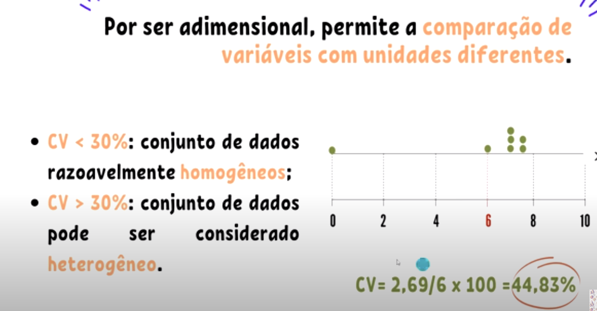

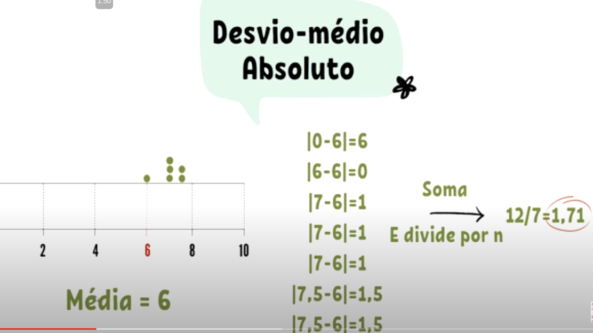

- Medidas de Forma

# Terceiro Encontro

## Teste de siginificância para hipótese nula

Considere a seguinte afirmação:

Estudantes que receberam aulas on-line tiveram pior desempenho que estudantes
que receberam aulas presenciais.

Para uma pesquisa que faça afirmações, um pesquisador precisa aplicar análise exploratória e:

1. Coletar uma amostra

Adotamos que a população seja o mundo real e as ideias sejam as hióteses de pesquisa, que poderão ser testadas por técnicas estatísticas denominadas **teste de significancia para a hipótese nula (teste de hipótese)**. Ou seja, é produzida uma hipótese de pesquisa e dela é gerada uma hipótese nula.

O teste estatístico serve para validar se os dados fornecem evidência suficiente para que se possa aceitar como verdadeira a hipótese de pesquisa, precavendo-se, com certa segurança, de que as diferenças observadas nos dados
não são meramente casuais.

2. Criar hipóteses

**Hipótese Nula(H0):** Descrita em termos de parâmetros populacionais, ela propõe, basicamente que não há diferença entre certa caracteristicas de uma população. Sob essa hipótese, as diferenças observadas nos dados são consideradas casuais. É a hipótese assumida como verdadeira para a construção do teste.

**Hipótese Alternativa(HA):** É a hipótese de pesquisa, em que as coisas são diferentes umas das outras ou diferentes de uma expectativa teórica.

Exemplos:

## Valor-p

O objetivo principal de um teste estatístico é de determinar se um conjunto de dados observados é tão diferente do esperado na hipótese bula de forma que você deveria REJEITAR a hipótese nula.

- Quando assuminos que a hipótese nula é verdadeira, o teste calcula um valor-p, isto é, a probabilidade de o resultado da amostra estar tão ou mais distante do resultado esperado pela hipótese nula.

- Valor-p pode ser definida como a probabilidade de se encontrar os resultados encontrados em um mundo no qual a hipótese nula seja verdadeira.

Exemplo: Precisamos avaliar se uma moeda não está viciada, ou seja, para cada
100x que jogo a moeda, devo ter em média 50x para cada lado da moeda.

- H0: a moeda é justa (probabilidade de cara/coroa) é igual a **0,5**
- H1: a moeda NÃO é justa (probabilidade de cara/coroa) NÃO é igual a **0,5**

Ao realizar o experimento, jogamos a moeda 100x, e vimos 65 caras.

Construimos o modelo binomial dos 100 lançamentos:

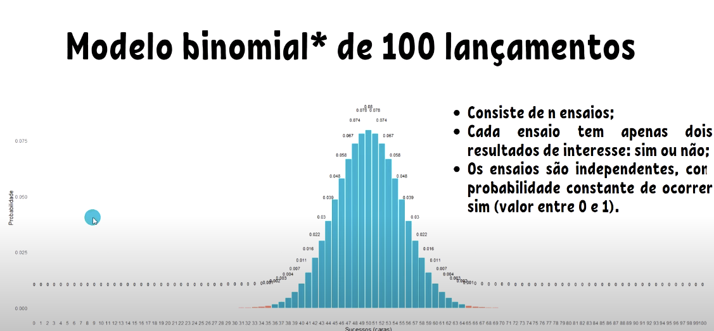

Avaliando o modelo criado, podemos avaliar que para uma ocorrência de 65 caras, a probabilidade é de 0.004

Ou seja, dada que a hipotese nula é verdadeira, qual é a probabilidade de observar esse padrão dos dados por acaso ? 
Se essa probabilidade for pequena (valor-p), siginifca que é muito improvável que H0 seja verdadeira e, por isso a rejeitamos.

Por fim temos, que a ocorrencia de 65/100 caras ser apenas acaso, é de 0.04%.

Obs: Geralmente, antes de se calcular o p, se estabelece o valor mínimo que vamos aceitar para legitimar a hipótese nula. Esse valor é geralmente 0.05 nas ciências sociais. Ou seja, a partir de 5% de probabilidade, nós temos dados que corroboram a nossa hipótese alternativa (esse valor é chamado de alfa, ou α).

#### É importante perceber uma coisa super delicada, que pode ser difícil de compreender a princípio. A probabilidade p refere-se à probabilidade de encontrar o resultado encontrado em um mundo onde a hipótese nula é verdadeira. É por isso que nós não podemos confirmar a hipótese alternativa. Isso porque a estatística p está relacionada ao mundo hipotético no qual essas diferenças não existem. Nós estamos sempre testando a probabilidade de não existir diferenças. Nós não possuímos nenhuma estimativa relacionada ao mundo no qual essa diferença realmente exista.

#### É por esses motivos que a hipótese alternativa deve ser feita antes de se realizar o teste de hipóteses. Se criamos uma hipótese alternativa antes de realizarmos a análise, quando nosso p é abaixo de 5% (ou do valor estimado de α), nós podemos corroborar a hipótese alternativa. Se criamos uma hipótese alternativa após a análise, é fácil de querer manipular a hipótese alternativa para uma que faça mais sentido aos resultados. Isso é errado e antiético, e possui um nome: HARKing; em tradução livre, hipotetizar após o conhecimento dos resultados.

## Diferença entre dois grupos

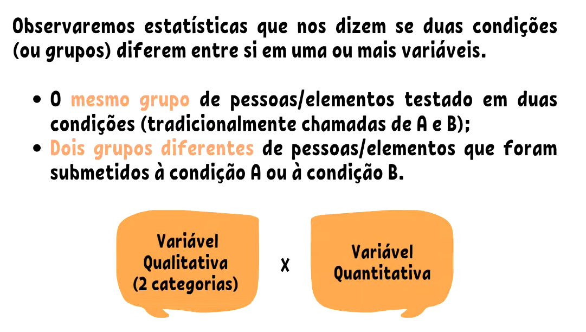

### Grupos independentes

#### Teste T de student

é usado para comparar a média de dois grupos independentes.

Pressupostos:

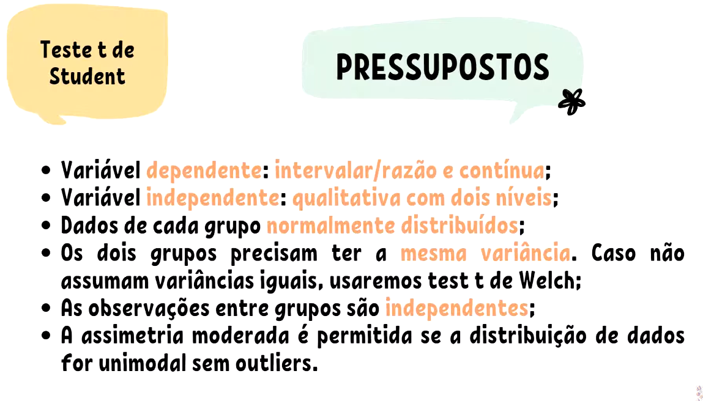

Ex: Suponha que medimos a altura de 100 individuos, 50 mulheres (grupo A) e 50 homens (Grupo B). Queremos saber se a altura média das mulheres é significantemente diferente da altura média dos homens.

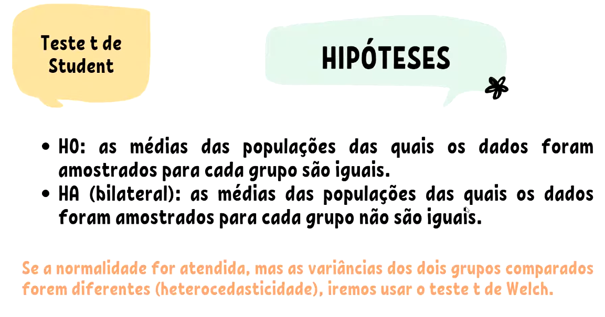

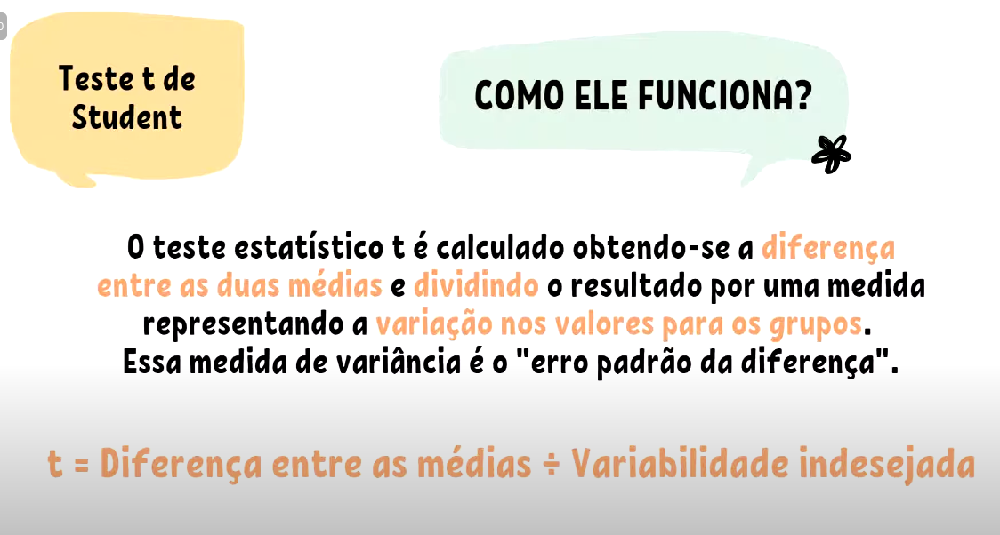

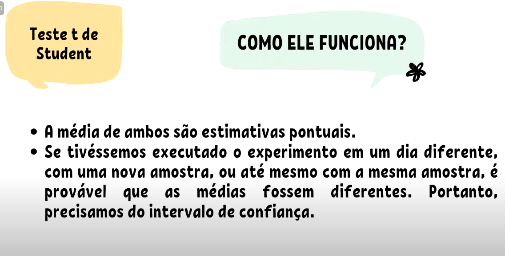

#### Teste U de Mann-Whitney

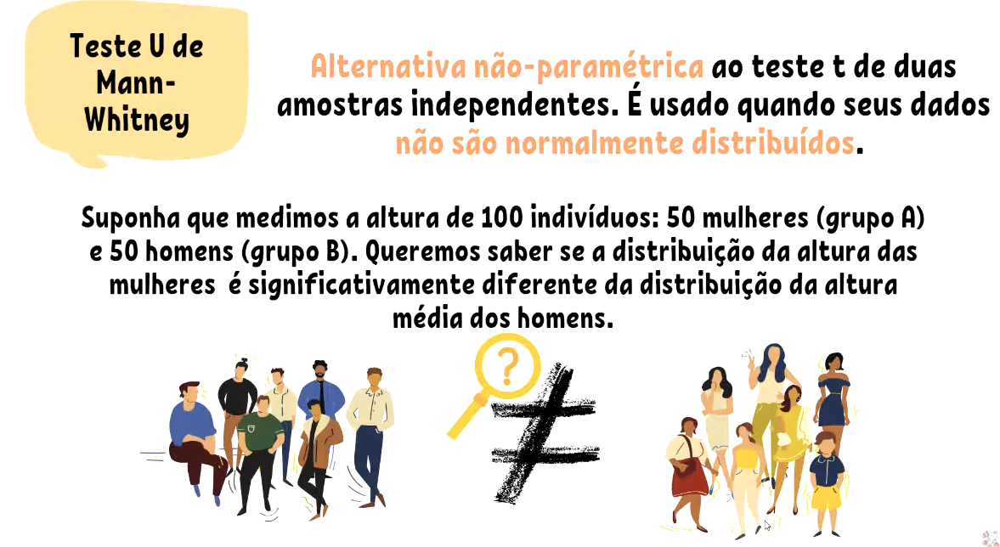

Pressupostos:

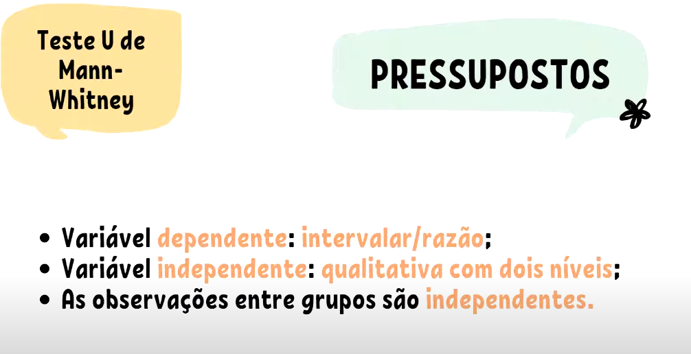

Como funciona:

Calculo a média da posição.

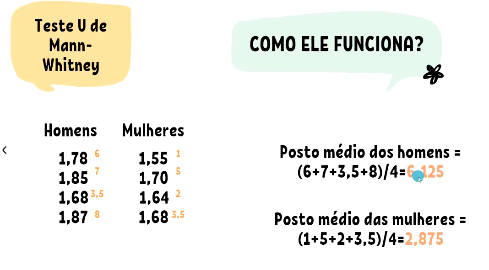

## Associações entre variáveis categóricas/qualitativa

- Esse tipo de teste é usado para determinar se duas vriáveis cetegóricas (qualitativas) estão associadas.
- A análise se dá por meio da tabela de contigência.
- A análise que, as vezes, o termo "independente" é usado para significar que não há assiciação entre as variáveis.

### [Teste Qui-quadrado](https://www.youtube.com/watch?v=e29QDMg_58s)

#### Pressuposto
O teste Qui-quadrado carrega alguns pressupostos com ele:

- Os níveis (ou categorias) das variáveis são mutualmente exclusivos. (Não pode contabilizar nos dois grupos).
- Duas variáveis qualitativas com dois ou mais níveis cada
- Unidades de observação não são pareadas.
- O valor esperado das células deve ser 5 ou mais em pelo menos 80% das células, e nenhuma célula deve ter um valor esperado menor que um.

**Quando os dados não representam essas condições, podemos usar o teste exato de Fisher**

#### Hipóteses

H0: não há associação entre as duas variáveis, ou seja, as variáveis de linha e coluna da tabela de contingência são independentes.

HA: existe uma associação entre as duas variáveis, ou seja, as variáveis de linha e coluna são dependentes.

#### Calculos do teste

Diferença entre as fequências observadas e as esperadas.  

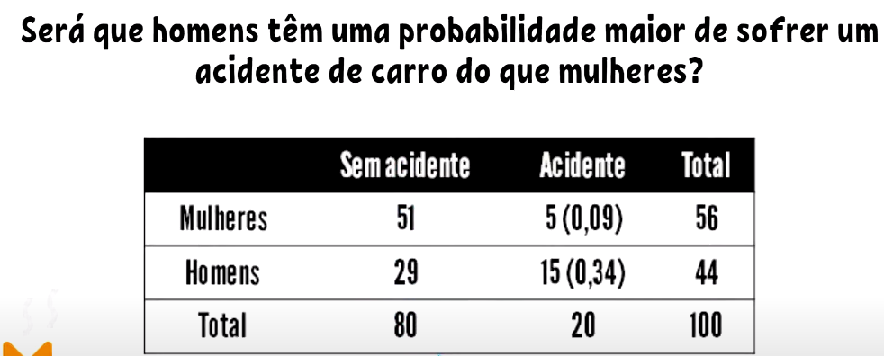

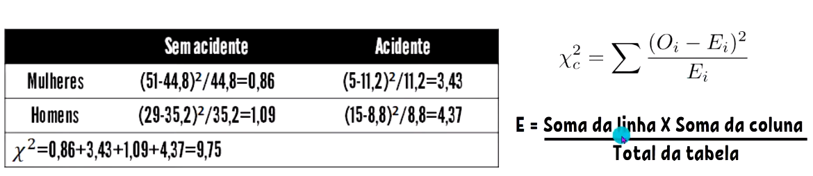

E(0,0) = (56*80)/100 = 44,8
E(0,1) = (56*20)/100 = 11,2
E(1,0) = (44*80)/100 = 35,2
E(1,1) = (44*20)/100 = 8,8

- Validações: 

O valor esperado das células **É** 5 ou mais em 80% das células. 

Nenhuma célula tem o valor esperado menor que 1

**Valor Final:** X² = 9,75

**Valor p:** 0,004

Resumindo: O valor p que chegamos, indica que estamos abaixo do nível de significancia de 0,5% ou seja, podemos excluir a hipótese nula. E podemos fazer a associação entre acidente e gênero.

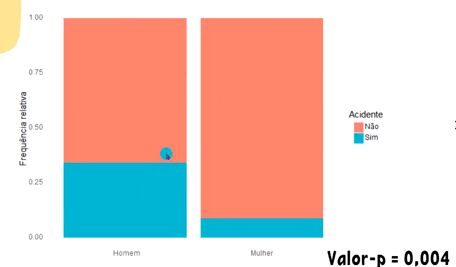

#### Fun facts

O valor p está relacionado ao valor p amostral

### Teste Exato de Fisher

