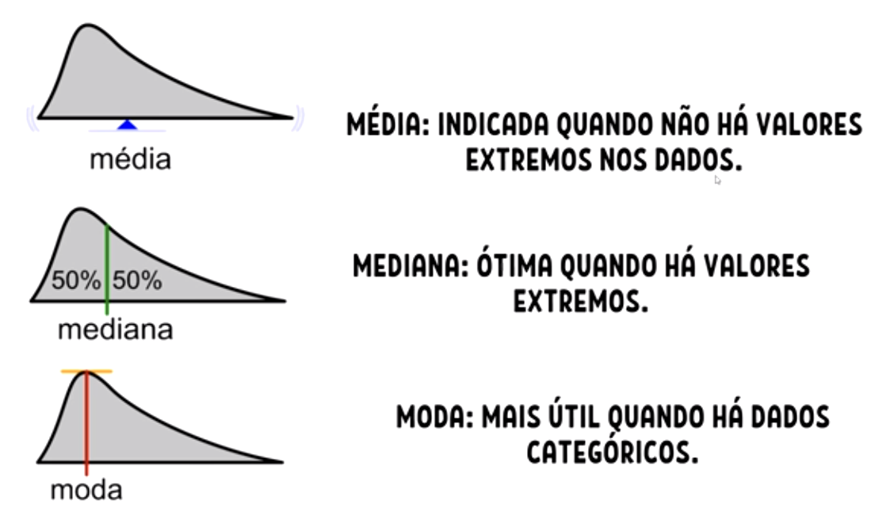

Epistemologia é o nome dado ao estudo do conhecimento e suas formas. Tenta descobrir como o conhecimento é adquirido pelas pessoas a partir dos princípios da crença, verdade e justificativa. Atualmente é compreendida como a Teoria do Conhecimento, mas nem sempre foi assim.

- Análise de Dados Aplicados

### Teste de hipótese

==>  Problema da indução

- Ciência é indutiva, abrea mão da certeza e verdade em detrimento da dúvida

Um exemplo sobre o problema da indução, é que para se testar a hipótese que 10.000 ovos, são de galinha, é necessário testar um a um, o que seria virtualmente impossível no caso de uma pesquisa de remédios por exemplo. Por isso em uma pesquisa, sempre buscamos testar os diferentes.

- H0 é a chamada hipótese nula. Testa a igualdade ==
- Ha é a hipótese alternativa, testa a diferença !=

- Explicação simples de P: é a chance de erro em afirmar que coisas são diferentes
Ex: Ao assumir que o Grupo A é diferente do Grupo B, tenho um p = 0,01%. O processo engloba chegar ao valor de p. Em um segundo momento é afirmado se o p é baixo ou pequeno. 

==> Vídeo novo

Estatistic descritiva

Organizar, resumir, e apresentar os dados (tabelas gráficos e medidas-resumo)

 - N tem conclusões nessa etapa
 - Observar determinados aspectos relevantes e começar a delinear hipóteses

 - Se faz perguntas como:

 Os dados me dizem algo importante ?

 ==> Temos 3 tipos de estatistica descritiva:

 Univariada
 Bivariada: busco relações entre variáveis 
 Multivariada

==> Univariada

Tipo de variável:

Qualitativa:

# Medidas-Resumo
## Medidas de Posição

### Medidas de Tendência Central: 

#### Média :é um resumo dos dados, por issso, pode esconder informações relevantes.
#### Média Ponderada: a ponderação é feita sempre que precisamos dar mais importância a um caso do que ao outro (atribuir pesos diferentes). A mediana é uma medida robusta, o que significa que ela não é sensível a valores extremos ou discrepantes nos dados, tornando-a útil para resumir conjuntos de dados que podem conter valores atípicos ou extremos.

#### Moda: la representa o valor que aparece com mais frequência em um conjunto de dados. Em outras palavras, a moda é o número que ocorre com maior frequência. A moda é especialmente útil quando estamos interessados em identificar os valores mais comuns ou populares em um conjunto de dados. É a unica medida de posição que também pode ser usada para variáveis qualitativas.

#### Mediana: representa o valor que está exatamente no meio de um conjunto de dados quando esses números estão organizados em ordem crescente ou decrescente. 

### Medidas Separatrizes: Quartis, Decis e Percentis

- Medidas de Dispersão

#### Amplitude: representa a diff entre o maior e menor elemento de um conjunto.

#### Desvio-médio Absoluto: média aritimética dos desvios absolutos.

#### Variância: 

A variância é uma medida que nos ajuda a entender o quão espalhados ou dispersos estão os valores em um conjunto de dados. Ela calcula a média das diferenças quadradas entre cada valor e a média geral do conjunto. Isso pode parecer um pouco complicado, mas, basicamente, a variância nos diz o quão os valores se afastam da média. Quanto maior a variância, mais espalhados estão os dados, e quanto menor, mais próximos eles estão da média.
Por exemplo, considere um conjunto de números: 2, 4, 6, 8, 10. A média é 6. Agora, calculamos as diferenças quadradas entre cada valor e a média: (2-6)², (4-6)², (6-6)², (8-6)², e (10-6)². Somamos essas diferenças quadradas e as dividimos pelo número total de valores no conjunto - 1. O resultado é a variância, também chamada de s². Fica assim:
Calculamos a média dos valores: (2 + 4 + 6 + 8 + 10) / 5 = 30 / 5 = 6.
Calculamos as diferenças entre cada valor e a média e, em seguida, elevamos essas diferenças ao quadrado: (2-6)² = 16, (4-6)² = 4, (6-6)² = 0, (8-6)² = 4, (10-6)² = 16.
Somamos essas diferenças quadradas: 16 + 4 + 0 + 4 + 16 = 40.
Calculamos a variância, que é a média dessas diferenças quadradas: 40 / (5 - 1) = 40 / 4 = 10.
A variância é útil para entender a dispersão dos dados, mas os valores normalmente são quadrados, o que pode não ser muito intuitivo. É por isso que frequentemente usamos o desvio padrão para tornar essa medida mais fácil de interpretar.

- Medidas de Forma

